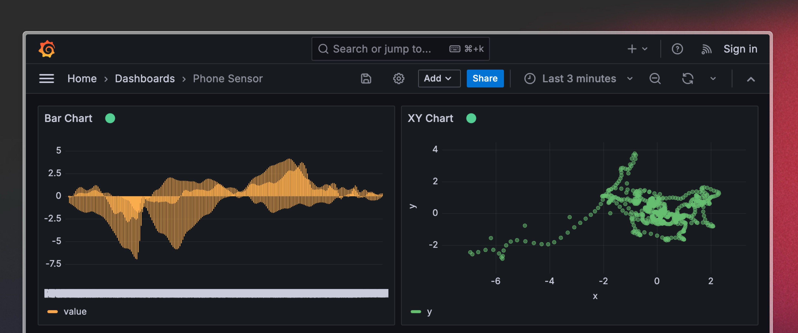

# Demo to visualize the sensor data from your phone

[Sensor Logger](https://github.com/tszheichoi/awesome-sensor-logger) is a free, easy-to-use, cross-platform data logger that logs readings from common motion-related sensors on smartphones. Recordings can be exported as a zipped CSV file, or streamed to Timeplus via HTTP API.

Demo video: https://youtu.be/vi4Yl6L4_Dw?t=1049

## Setup Guide

### Step 1: start docker compose
Install [Docker Desktop](https://docs.docker.com/desktop/) and fork this repo or download the [docker-compose.yml](docker-compose.yml) to a local folder. Start everything via `docker compose up`. The following containers will be started:
* latest version of Timeplus Enterprise, to receive the live data and apply stream processing
* latest version of Grafana, to visualize the live data with streaming SQL

Wait for about half a minute to have all containers up running.

### Step 2: configure Timeplus Enteprise

* Open http://localhost:8000 and create an account with `admin` as the user name and `password` as the password. * Login with that account.
* On the [SQL Console](http://localhost:8000/default/console/query), run the following SQL: `CREATE STREAM phone(raw string)` This will create a data stream for any JSON document.

### Step 3: install mobile app and push data to Proton
Download Sensor Logger at www.tszheichoi.com/sensorlogger.

| Android | iOS |
|:-:|:-:|
| [](https://play.google.com/store/apps/details?id=com.kelvin.sensorapp&pcampaignid=pcampaignidMKT-Other-global-all-co-prtnr-py-PartBadge-Mar2515-1) | [](https://apps.apple.com/app/id1531582925) |

Open the app, and go to the settings page, by clicking the button at the bottom.
1. Click the `Data Streaming` menu.
2. Turn on `Enable HTTP Push`.
3. Get your IP for your server (on Mac, you can hold Option key and click the WiFi icon to get the IP address), and set the `Push URL` as `http://<ip>:8000/default/api/v1beta2/streams/phone/ingest?format=raw`
4. For the `Auth Header`, please set `Basic YWRtaW46cGFzc3dvcmQ=` (we encode admin:password to this base64 string)
5. Optionally, you can turn on `Skip Writing` if you are on the paid plan.

### Step 3: view the live dashboard in Grafana

In your laptop/server, access `http://localhost:3000` and open the `Phone Sensor` dashboard.


As a bonus,you can build a live dashboard in Timeplus without using Grafana.

Go to the `Dashboards` page. Click `New Dashboard`. Set a name, then on the top right corner, choose the dot button and choose `View/Edit JSON` and paste this JSON in:

```json
[
  {
    "id": "9ba79499-253e-4d40-99e8-9f6e9170b082",
    "title": "x-y-z",
    "description": "",
    "position": {
      "h": 5,
      "nextX": 12,
      "nextY": 5,
      "w": 12,
      "x": 0,
      "y": 0
    },
    "viz_type": "chart",
    "viz_content": "SELECT\n  to_datetime64(cast(p:time, 'int64') / 1000000000, 3) AS time, array_join([tuple_cast('x',to_float32_or_zero(p:values.x)),\n  tuple_cast('y',to_float32_or_zero(p:values.y)),tuple_cast('z',to_float32_or_zero(p:values.z))]) as t, t.1 as axis, t.2 as value\nFROM\n  (\n    SELECT\n      array_join(json_extract_array(raw, 'payload')) AS p\n    FROM\n      phone\n    WHERE\n      p:name = 'gyroscope'\n  )",
    "viz_config": {
      "chartType": "line",
      "config": {
        "color": "axis",
        "colors": [
          "#ED64A6",
          "#F0BE3E",
          "#DA4B36",
          "#9A1563",
          "#FF4A71",
          "#D12D50",
          "#8934D9",
          "#D53F8C",
          "#F7775A",
          "#8934D9"
        ],
        "dataLabel": false,
        "fractionDigits": 2,
        "gridlines": true,
        "legend": true,
        "lineStyle": "curve",
        "points": false,
        "showAll": false,
        "unit": {
          "position": "left",
          "value": ""
        },
        "xAxis": "time",
        "xFormat": "",
        "xRange": "Infinity",
        "xTitle": "",
        "yAxis": "value",
        "yRange": {
          "max": null,
          "min": null
        },
        "yTickLabel": {
          "maxChar": 25
        },
        "yTitle": ""
      }
    }
  }
]
```
