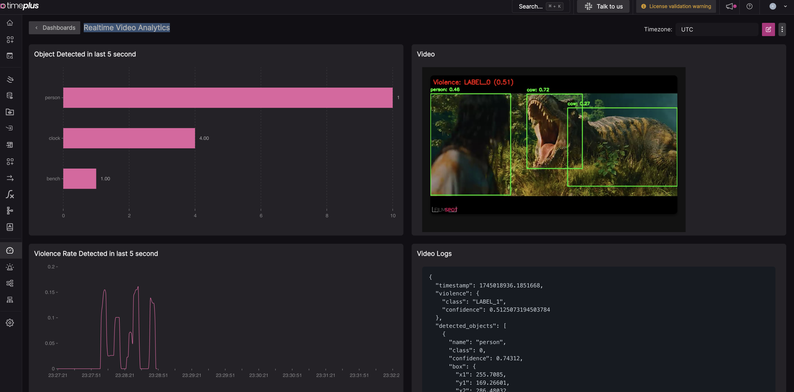

this demo shows how to use timeplus to analysis video in realtime.

two vision model are used to extract information from the video.
1. ultralytics/yolov8n is used to extract detected objects
2. jaranohaal/vit-base-violence-detection is used to check if there is violent behavior in the video

here is a quick start to run the demo

1. put any video you want to analysis into sample folder , and set the environment in .env INPUT_STREAM='/timeplus/samples/video_file_path', or you can also set the youtube vedio file url into INPUT_STREAM
2. start the docker compose
3. run the onboarding flow of the timeplus from browser with 'localhost:8000'
4. run `make create_dashboard` to create the video analytics dashboard in timeplus

in the Timeplus console UI, go to dashboard and open `Realtime Video Analytics` dashboard.

